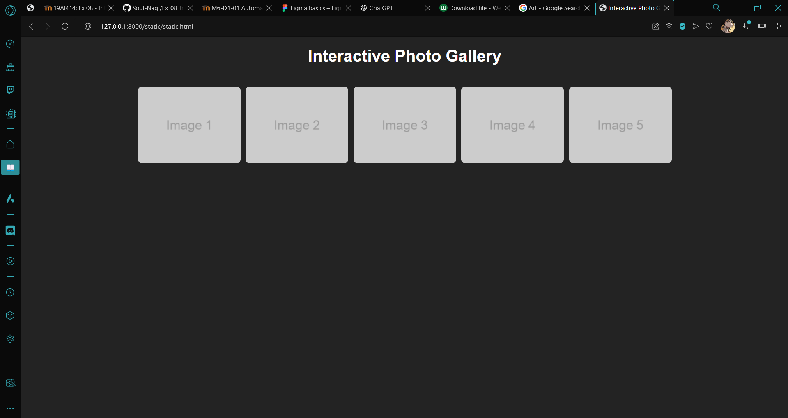

# Ex.08 Design of Interactive Image Gallery
## Date:
13/05/2025
## AIM:
To design a web application for an inteactive image gallery with minimum five images.

## DESIGN STEPS:

### Step 1:
Clone the github repository and create Django admin interface.

### Step 2:
Change settings.py file to allow request from all hosts.

### Step 3:
Use CSS for positioning and styling.

### Step 4:
Write JavaScript program for implementing interactivity.

### Step 5:
Validate the HTML and CSS code.

### Step 6:
Publish the website in the given URL.

## PROGRAM :
```
<!DOCTYPE html>
<html lang="en">
<head>
    <meta charset="UTF-8">
    <meta name="viewport" content="width=device-width, initial-scale=1.0">
    <title>Interactive Photo Gallery</title>
    <style>
        body {
            font-family: Arial, sans-serif;
            margin: 0;
            padding: 0;
            background-color: #f4f4f4;
        }
        .gallery {
            display: flex;
            flex-wrap: wrap;
            gap: 10px;
            justify-content: center;
            padding: 20px;
        }
        .gallery img {
            width: 200px;
            height: 150px;
            object-fit: cover;
            border-radius: 8px;
            cursor: pointer;
            transition: transform 0.3s;
        }
        .gallery img:hover {
            transform: scale(1.1);
        }
        .modal {
            display: none;
            position: fixed;
            top: 0;
            left: 0;
            width: 100%;
            height: 100%;
            background-color: rgba(0, 0, 0, 0.8);
            justify-content: center;
            align-items: center;
        }
        .modal img {
            max-width: 90%;
            max-height: 80%;
            border-radius: 10px;
        }
        .modal-close {
            position: absolute;
            top: 20px;
            right: 30px;
            font-size: 30px;
            color: white;
            cursor: pointer;
        }
    </style>
</head>
<body>

<h1 style="text-align: center; margin-top: 20px;">Interactive Photo Gallery</h1>
<div class="gallery">
    
    
    
    
    
</div>
<div class="modal" id="imageModal">
    <span class="modal-close" id="closeModal">&times;</span>
    
</div>

<script>
    const galleryImages = document.querySelectorAll('.gallery img');
    const modal = document.getElementById('imageModal');
    const modalImage = document.getElementById('modalImage');
    const closeModal = document.getElementById('closeModal');

    galleryImages.forEach(img => {
        img.addEventListener('click', () => {
            modal.style.display = 'flex';
            modalImage.src = img.src;
        });
    });

    closeModal.addEventListener('click', () => {
        modal.style.display = 'none';
    });

    modal.addEventListener('click', (e) => {
        if (e.target === modal) {
            modal.style.display = 'none';
        }
    });
</script>

</body>
</html>
```
## OUTPUT:

## RESULT:
The program for designing an interactive image gallery using HTML, CSS and JavaScript is executed successfully.
